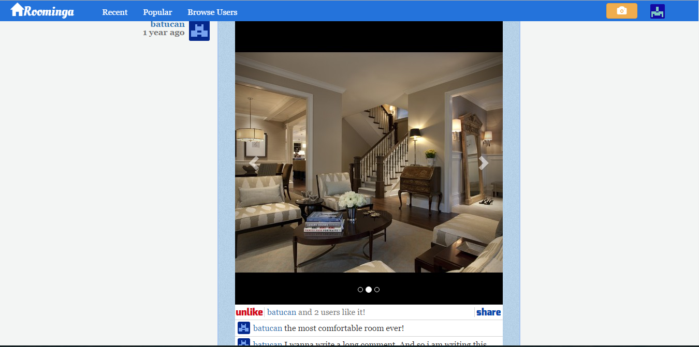

# Roominga

Roominga is a photo-sharing website where people can share their photos. I made this application for learning the Laravel PHP framework. Currently, too many features need to be added, but if you want to develop applications such as this one, it could be helpful to examine this code. Feel free to use it and fork it. :)

Roominga is heavily inspired by [Larabook](https://github.com/laracasts/larabook) and by [Instagram](https://www.instagram.com/).



## Requirements

* Apache Web Server
* PHP 5.4 or greater
* MCrypt PHP Extension
* MySQL
* Composer

## Installation

1. Run `composer update` command to create framework and dependencies.
2. Create a new database called 'roominga'.
3. Change application's database configuration based on your MySQL configurations from `app/config/database.php`:

 ```php
		'mysql' => array(
			'driver'   => 'mysql',
			'host'     => 'localhost',
			'database' => 'roominga',
			'username' => 'root',
			'password' => '',
			'charset'  => 'utf8',
			'prefix'   => '',
		),
 ```
4. Run `php artisan migrate:install` command to create migration table.
5. Run `php artisan migrate` command to create tables of application.
6. Run `php artisan db:seed` command to generate some users to `users` table.
7. Run `php artisan serve` command to make your application on.

## License

This package is licensed under the MIT license.
